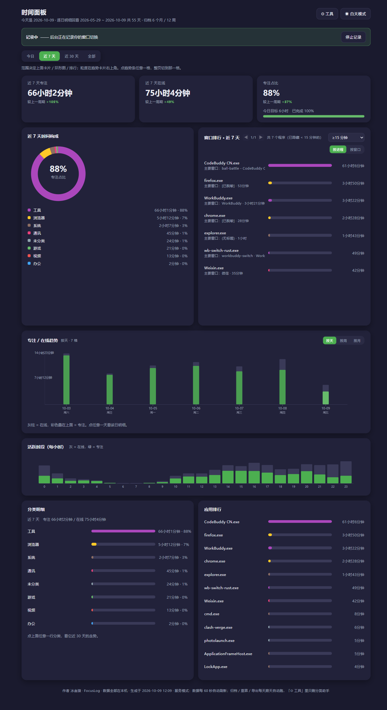
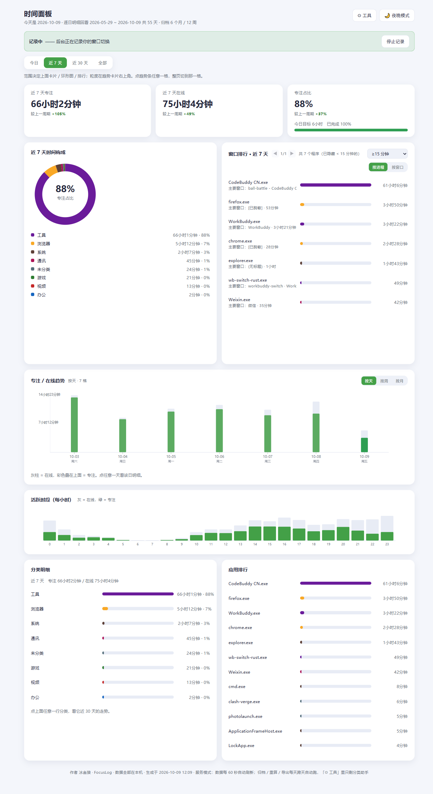

# FocusLog · 焦点监控

> **本地 Windows 时间记录**：你在电脑上做了什么、专注了多久，一目了然。
> 纯本地 · 零依赖（朋友免装 Python，双击就用）· 数据不联网不上传 · 全中文界面

  

**作者：冰叁狼（GitHub: [mniLiHua](https://github.com/mniLiHua)）**

---

## 这是什么

一个运行在你自己电脑上的时间记录工具：后台记录窗口切换，网页看板展示
每日专注/在线时长、每小时分布、趋势、窗口排行，并支持目标进度、弹窗提醒、
每周自动备份、一键体检。**看数据、改分类、开关自启、导入旧数据——全部在浏览器里完成。**

## 界面预览

| 夜晚模式 | 白天模式 |
|---|---|
|  |  |

## 分类方案专区

不想自己配规则？到 **[分类方案/](分类方案/README.md)** 挑一份社区方案直接用；
也欢迎把你的方案分享出来（PR 即可）。

## 功能亮点

- **网页看板**：今日概览 / 每小时热力 / 趋势图（可点选回看任意一天）/ 窗口排行
  （按进程聚合+分页+时长门槛）/ 分类趋势 / 番茄钟 / 数据体检
- **白天 & 夜晚双主题**，一键切换、自动记忆
- **分类体系**：按进程名 + 窗口关键词双规则；分类助手批量归类；支持通配符
- **全自动后台**：跨天自动维护/归档、每周自动备份（目录与间隔可配）、
  双实例运行时自检（发现旧版记录程序自动关闭并禁其自启）
- **一键体检**：记录进程 / 日志在写 / 自启指向 / 旧副本扫描 / 归档欠账，✅❌ 一目了然
- **搬家友好**：换电脑或从旧版本升级，「导入旧数据」自动搜索旧文件夹，
  只复制、不覆盖、先整包备份
- **零依赖分发**：发布包免装 Python，解压双击即用；bat 提示 10 秒自动关闭

## 快速开始

1. 下载 Releases 里的 `FocusLog_latest.zip` 并解压
2. 双击 **`开始记录.bat`**（立即开始记录 + 设为开机自启，一步到位）
3. 双击 **`打开面板.bat`** —— 浏览器自动打开 `http://127.0.0.1:47823/`
4. 首次使用按页面顶部的三步引导操作即可；进阶说明见 **`使用说明.txt`**

> 升级：双击 `更新.bat` 只换程序、不动数据；换电脑：面板 → 工具 → 导入旧数据。

## 目录结构

```
focuslog\
  打开面板.bat        ← 日常入口（看数据 + 所有开关）
  开始记录.bat        ← 开始记录 + 设开机自启（一步到位）
  更新.bat            ← 在线升级（仓库公开后可用）
  使用说明.txt        ← 纯文本新手指南
  VERSION.txt
  焦点监控\           记录进程与共享模块
  专注记录\           面板服务 + 全部数据（纯文本）
  工具\               进阶入口（停止/取消自启/快照面板/迁移/打包）
  docs\               变更日志与深度手册
```

## 架构与隐私

- 记录进程每 10 秒采样前台窗口，写入**纯文本日志**（`专注记录\YYYY-MM-DD.txt`）；
  锁屏、无键鼠、视频长空闲自动暂停，保证时长口径真实
- 面板是本机 HTTP 服务（`127.0.0.1:47823`），数据与操作**全部留在本机**，
  不联网、不上传、无遥测
- 性能：解析层文件级缓存 + 聚合结果按"数据版本"缓存，
  55 天全量统计首次 ~2.4s，之后毫秒级

## 开发

```
工具\build.bat        重打包三个 exe（改 .py 后必须跑）
工具\检查面板.py      发版前自检（JS 语法/挂载检查/主题成对）
工具\打包发布.bat     生成不含任何个人数据的发布 zip
```

技术栈：Python 3 标准库（http.server / sqlite-free / 手写 SVG 图表），
前端零框架零构建；打包 PyInstaller onefile。

## 安全性与资源占用

**安全模型**（设计上没有可泄露的通道）：

- 数据只写本地纯文本文件，任何一段日志都能用记事本打开审计
- 面板服务只绑定 `127.0.0.1`（不监听局域网/公网），外部设备无法访问
- 无遥测、无埋点、无自动更新下载；升级包来自你信任的发布渠道
- 窗口标题在日志与面板中可一键脱敏（`[已脱敏]`）

**资源占用**（实测，55 天数据量、双进程常驻）：

| 进程 | 私有内存 | 说明 |
|---|---|---|
| focus_tracker（记录进程） | ~47 MB | 含跨天维护所需模块 |
| focuspanel（面板服务） | ~49 MB | 含全量数据缓存（换来毫秒级页面） |
| PyInstaller 引导壳 ×2 | ~3 MB | |
| **合计** | **≈ 100 MB** | CPU：平时 0%，跨天维护时几秒 |

Python + PyInstaller 有约 40MB 的进程地板价，以上数字已贴近地板。
页面打开速度：整页 HTML 与排行结果按"数据版本"缓存，实测 **15–70ms**。

## 开源协议

本项目以 [GPL-3.0](LICENSE) 协议开源 —— 可自由使用、修改、再分发；
**衍生作品必须同样以 GPL-3.0 开源**（不得闭源），并保留作者版权声明。

**作者：冰叁狼（GitHub: [mniLiHua](https://github.com/mniLiHua)）**
